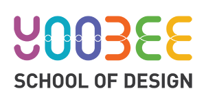

# Web Proposal Guide

The website proposal for your Diploma in Web and UX Design assignments is comprised of two documents:

- External document
- Internal document

Both documents must follow [Yoobee Web Proposal Best Practices](../best-practices/web-proposal.md).
 
## External document

This is a professionally designed client-facing document that is easy for the client to follow.

It must:
- have the name of the project, project commencement and projected completion date and both the client and author’s contact details on the cover page
- include a contents page
- introduce the client, the context, and the problem that needs to be solved
- communicate how the website or application will meet the client's needs in terms of overall user experience, which includes:
    - visual design
    - information architecture
    - functionality
- a simple timeline which corresponds to deliverables
- an agreement & contract with any terms & conditions
 
## Internal Document

This is for the development team to use internally. 

It may include:

- research results and analysis
- strategic planning
- conceptual and visual designs
- reflection
- technical UML diagrams (Use-case diagram, activity/flow diagram, etc)
- detailed timetable/Burndown chart (breakdown of hours, deadlines, deliverables for each stage)
- technical requirements (languages/code libraries/3rd party APIs/devices)
- development notes
- additional documentation required for the assignment

## Some sections to consider including

- client overview
- problem statement/intention of site/identified requirements
- research
  - personas/target market
  - competitor Analysis
    - pros and cons
  - user testing
    - results
    - analysis
- website analysis (for existing site)
- concept development with reasons for design choices that adhere to requirements that were identified in the planning stage
  - mood board/style tiles
  - typography
  - colour palette
- information architecture
  - site map
    - page relationships
  - wireframes
  - content
  - calls to action
- high fidelity mockups to give close representation of what the site will look like
  - mobile version
  - link to online prototype
- functionality
  - identified as a result of modelling the application's behaviour using UML diagrams
- SEO plan/strategy
- deliverables
- timeline/number of hours
  - corresponds to deliverables
- budget/costs
  - corresponds to deliverables and number of hours